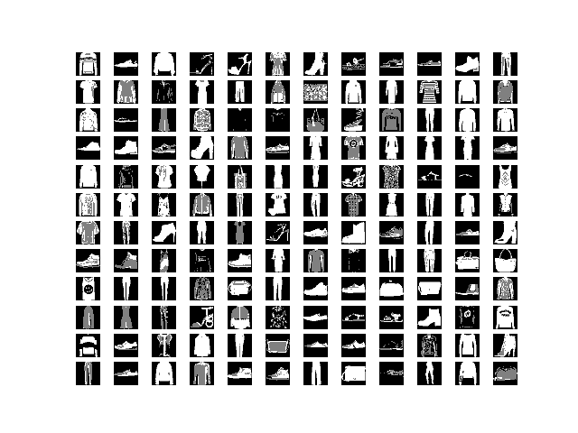
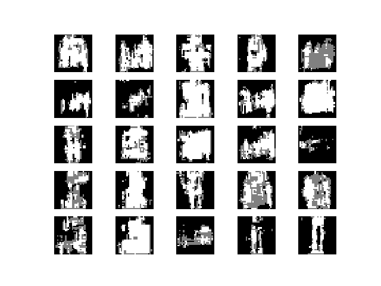

This is an experiment to teach a neural network to generate colour-mapped images.
We train a GAN to imitate images from the Fashion-MNIST dataset.
The catch is that instead of being composed of values between 0-255,
the images have been quantized so that all pixels are either 1) black, 2) gray or 3) white.
An example can be seen beneath.

For each pixel, the GAN generates a one-hot encoding for each of the three possible colours.
The output image is then created by selecting the colour with the highest value [in the one-hot] for each pixel.

Results after 2000 training steps:

